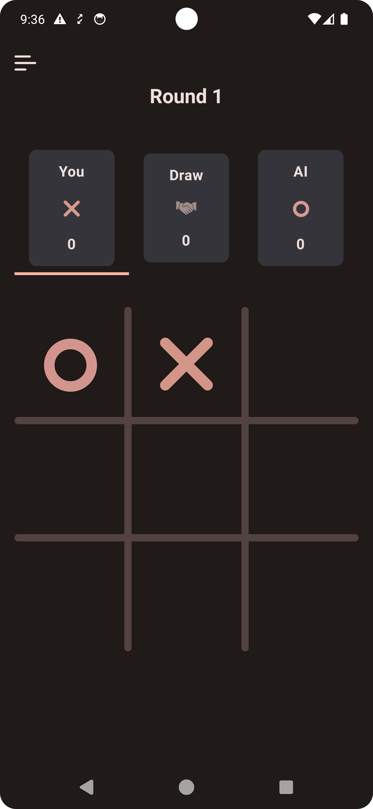
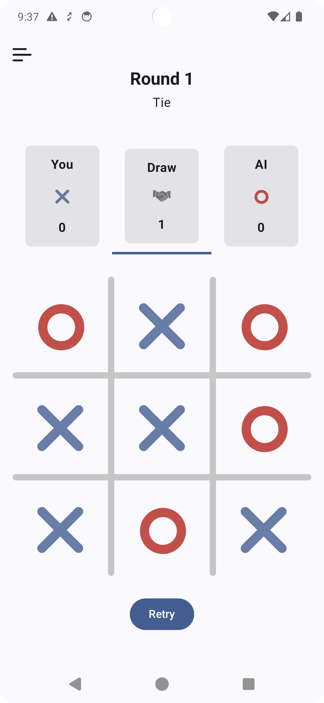

# TicTacToe-AI-MCTS-Minimax

**Work in Progress**

## Overview

TicTacToe-AI-MCTS-Minimax is an advanced implementation of the classic Tic Tac Toe game, showcasing the power of AI through the Monte Carlo Tree Search (MCTS) and Minimax algorithm with Alpha-Beta pruning. This project demonstrates efficient decision-making and strategic gameplay, offering a formidable AI opponent.

The project is built for Android using Jetpack Compose, ensuring a modern, declarative UI framework for a smooth and interactive gaming experience.

## Branches

-   The **Minimax** implementation can be found in the `minimax` branch.
    
-   The **MCTS** implementation can be found in the `mcts` branch.

## Algorithms

### Minimax with Alpha-Beta Pruning

The AI evaluates all possible moves to determine the best outcome, pruning unnecessary branches to improve efficiency.

-   **Minimax:** Explores all possible game states to choose the optimal move.

-   **Alpha-Beta Pruning:** Reduces the number of nodes evaluated in the Minimax tree, enhancing performance.

## Images

## Screenshots

    
    
    

## Video
<video width="640" height="360" controls>
  <source src="assets/minimax_alpha_beta.mp4" type="video/mp4">
  Your browser does not support the video tag.
</video>
